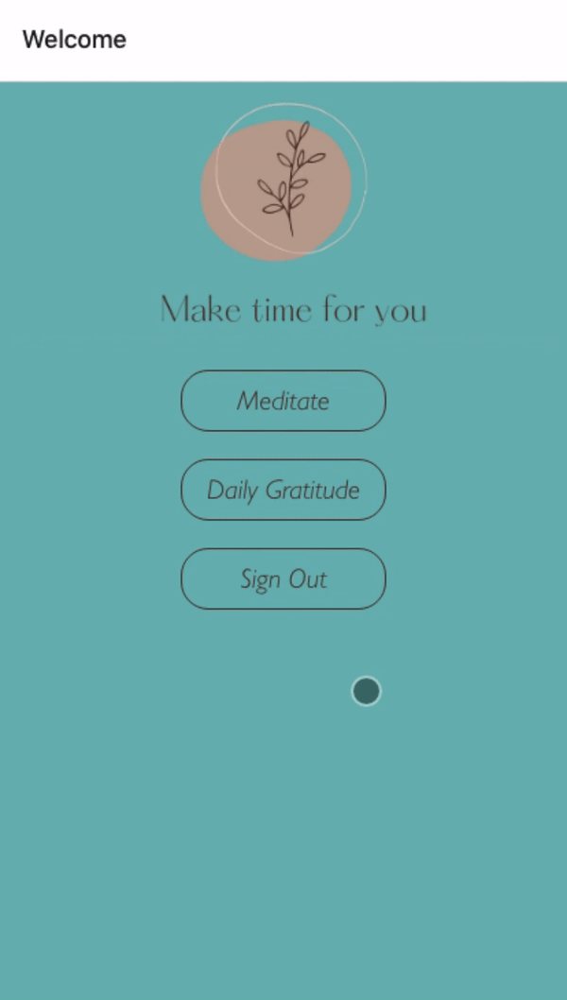

# Restore Application

## Table of Contents

1.  [General Info](#general-info)
2.  [Technologies](#technologies)
3.  [FAQs](#faqs)

### General Info

---

Restore is a self-care mobile application that allows users to build habits.
Users can meditate and journal each day.

## Technologies

---

- Backend: Firebase
- Frontend: React Native, Redux

## FAQs

---

A list of frequently asked questions

1.  **How to run Restore locally**

    - npm install
    - npm start
    - expo devtools will run, please navigate there to view Restore in either the web or device simulator

2.  **What's next for Restore?**
    My goals for the future of Restore are:

    - UI: Creating an alert when meditation is complete.
    - Tracking: building out a user profile page where self-care habits are tracked for the week and eventually for the year.
    - Water and mood log: Adding a section for users to track their water intake and mood each day.
    - Movement log: Adding a page that serves up youtube videos of excercises the user can do each day.
    - Success Page: Adding a page that pops up when a user has completed all daily self-care habits.
    - Deployment: Deploying the app to be open to the public.
